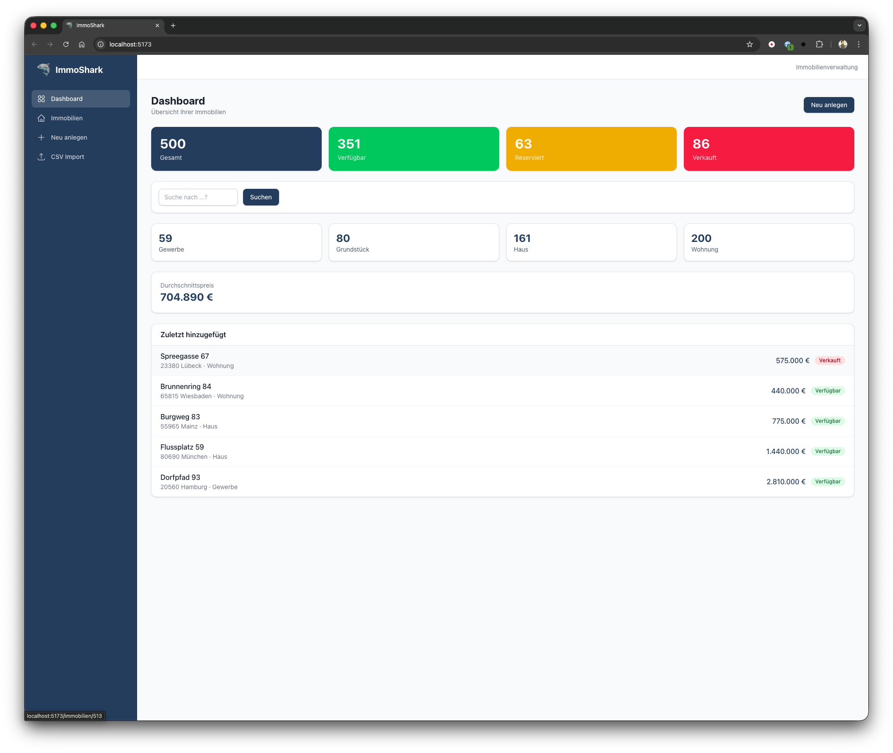

# ImmoShark

[](https://github.com/pekiti/immoshark)
[](https://www.typescriptlang.org/)
[](https://bun.sh/)
[](https://react.dev/)
[](https://tailwindcss.com/)
[](https://expressjs.com/)
[](https://www.sqlite.org/)
[](#tests)
[](https://opensource.org/licenses/MIT)

Lokale Webanwendung zur Verwaltung von Immobiliendaten. Importiere Objekte per CSV, durchsuche den Bestand mit Volltextsuche und pflege alle Daten per CRUD-Oberfläche — alles läuft lokal, ohne Cloud-Abhängigkeiten.

<p align="center">
  
</p>

---

## Inhaltsverzeichnis

- [Zweck](#zweck)
- [Features](#features)
- [Architektur](#architektur)
  - [Datenfluss](#datenfluss)
  - [Tech-Stack](#tech-stack)
  - [Designentscheidungen](#designentscheidungen)
- [Voraussetzungen](#voraussetzungen)
- [Installation & Start](#installation--start)
- [Tests](#tests)
- [Daten-Schema](#daten-schema)
  - [immobilien — Haupttabelle](#immobilien--haupttabelle)
  - [immobilien_bilder — Bildreferenzen](#immobilien_bilder--bildreferenzen)
  - [immobilien_fts — Volltextsuche (FTS5)](#immobilien_fts--volltextsuche-fts5)
  - [ER-Diagramm](#er-diagramm)
- [API-Endpunkte](#api-endpunkte)
- [Projektstruktur](#projektstruktur)
- [Dokumentation](#dokumentation)
- [Lizenz](#lizenz)

---

## Zweck

ImmoShark richtet sich an Immobilienmakler, die eine schlanke, lokale Lösung zum Verwalten ihres Bestands brauchen:

- **CSV-Import** — Bestehende Daten aus Tabellenkalkulationen übernehmen (deutsche Formate: `;`-Trennzeichen, Dezimalkomma)
- **Volltextsuche** — Über alle Textfelder suchen (Adressen, Beschreibungen, Kontaktdaten, Notizen, Status u.v.m.)
- **CRUD-Verwaltung** — Immobilien anlegen, bearbeiten, löschen mit Validierung
- **Dashboard** — Bestand auf einen Blick: Statistiken, Schnellsuche, letzte Objekte
- **Filterbare Liste** — Nach Typ, Status, Ort, Preis, Fläche, Zimmerzahl und Datum filtern

---

## Features

| Feature | Beschreibung |
|---------|-------------|
| **Sortierbare Spalten** | 8 Tabellenspalten per Klick sortierbar (aufsteigend → absteigend → unsortiert), inkl. "Hinzugefügt am" |
| **Schieberegler-Filter** | Preis, Fläche und Zimmeranzahl per Slider oder Direkteingabe filtern |
| **Datumsbereich-Filter** | "Hinzugefügt von/bis" mit nativen Datepickern filtern |
| **Veröffentlichungsdatum** | Optionales Feld pro Objekt: wann wurde die Immobilie im Portal/in der Zeitung veröffentlicht |
| **Such-Button** | Filter werden lokal aufgebaut und erst beim Klick auf "Suchen" oder Enter ausgelöst |
| **Notizen** | Freitextfeld (max. 500 Zeichen) für interne Notizen pro Objekt |
| **Kontakt-Gruppierung** | Objekte nach Ansprechpartner gruppiert anzeigen |
| **Volltextsuche** | FTS5-Suche über 13 Textfelder + LIKE-Fallback für numerische Felder |
| **CSV-Import** | 4-Schritt-Wizard: Upload → Spalten-Mapping (mit Auto-Erkennung) → Vorschau → Import. Erkennt dt. Datumsformat (TT.MM.JJJJ) |
| **URL-basierte Filter** | Alle Filterparameter in der URL — bookmarkbar, teilbar |

---

## Architektur

ImmoShark ist ein **Bun-Monorepo** mit drei Paketen:

```text
immoshark/
├── shared/          @immoshark/shared — Types, Enums, Zod-Validierung
├── server/          @immoshark/server — Express 5 REST-API
├── client/          @immoshark/client — React 19 SPA
└── data/            Beispiel-CSV + Generator-Script
```

### Datenfluss

```text
Browser (React SPA)
    │
    │  fetch /api/*
    ▼
Vite Dev Proxy (:5173 → :3002)
    │
    ▼
Express API (:3002)
    │  Zod-Validierung
    │  Service Layer (raw SQL)
    ▼
SQLite (WAL-Modus, FTS5)
    └── data/immoshark.db
```

### Tech-Stack

| Schicht | Technologie | Warum |
|---------|-------------|-------|
| Runtime | **Bun** | Native SQLite-Bindings, TypeScript ohne Compile-Step, schneller Paketmanager |
| API | **Express 5** | Bewährt, großes Ökosystem, einfaches Routing |
| Datenbank | **SQLite** (WAL + FTS5) | Zero-Config, eingebettet, Volltextsuche ohne externen Service |
| Validierung | **Zod** | Shared zwischen Client und Server, Runtime-Validierung mit Typ-Inferenz |
| Frontend | **React 19** + **Vite** | Schnelles HMR, modernes JSX-Transform |
| Styling | **Tailwind CSS 4** | Utility-First, kein separates Config-File nötig (v4 Vite Plugin) |
| Tests | **bun test** | Built-in Test-Runner, zero-config, keine Extra-Dependencies |

### Designentscheidungen

- **Kein ORM** — Raw SQL via `bun:sqlite` ist schneller und expliziter. Das Mapping zwischen camelCase (TypeScript) und snake_case (SQL) findet im Service-Layer statt.
- **FTS5 mit `unicode61` Tokenizer** — Deutsche Umlaute (ä, ö, ü, ß) werden korrekt tokenisiert. Sync-Triggers halten den FTS-Index automatisch aktuell. Numerische Felder (Preis, Baujahr etc.) werden zusätzlich per LIKE-Fallback durchsucht.
- **URL-basierte Filter** — Alle Filterparameter liegen in der URL. Das macht Filter bookmarkbar und braucht keinen globalen State-Manager.
- **SQL-Injection-Schutz bei Sortierung** — Sortierbare Spalten werden gegen eine Whitelist validiert, da `ORDER BY`-Spalten nicht über parametrisierte Queries geschützt werden können.
- **Bilder als separate Tabelle** — Statt JSON-Array in der Immobilien-Tabelle. Ermöglicht Sortierung und zukünftige Erweiterungen.
- **Additive Migration** — Bestehende Datenbanken werden automatisch erweitert (ALTER TABLE, FTS-Index-Rebuild), ohne Datenverlust.
- **Deutsches CSV-Format** — Automatische Erkennung von `;` vs. `,` Delimiter, Dezimalkomma-Konvertierung (`1.234,56` → `1234.56`) und deutsches Datumsformat (`TT.MM.JJJJ` → `YYYY-MM-DD`).
- **Test-Seam per `setDb()`** — Minimaler Injection-Point, damit Tests eine In-Memory-DB nutzen können, ohne Service-Code zu ändern.

---

## Voraussetzungen

| Tool | Version | Zweck | Installation |
|------|---------|-------|-------------|
| **Git** | >= 2.x | Versionskontrolle | [git-scm.com](https://git-scm.com/) oder `brew install git` |
| **Bun** | >= 1.1 | Runtime, Paketmanager, SQLite | [bun.sh](https://bun.sh/) |

Bun ersetzt Node.js, npm und einen separaten TypeScript-Compiler. Es bringt native SQLite-Bindings mit — dadurch entfällt eine separate SQLite-Installation.

> **Hinweis:** Vite und TypeScript werden als Projekt-Abhängigkeiten installiert (nicht global nötig). Docker wird für die Entwicklung nicht benötigt.

### Plattform-spezifisch

**macOS:**

```bash
# Xcode Command Line Tools (für Git)
xcode-select --install

# Bun
curl -fsSL https://bun.sh/install | bash
```

**Linux (Ubuntu/Debian):**

```bash
sudo apt update && sudo apt install -y git curl unzip
curl -fsSL https://bun.sh/install | bash
```

**Windows (WSL2):**

```bash
# In WSL2-Terminal:
curl -fsSL https://bun.sh/install | bash
```

---

## Installation & Start

```bash
# 1. Repository klonen
git clone https://github.com/pekiti/immoshark.git
cd immoshark

# 2. Abhängigkeiten installieren
bun install

# 3. Testdaten laden (6 Basis-Immobilien)
bun run seed

# Optional: 500 Testdaten generieren (erzeugt data/beispiel-immobilien.csv)
bun data/generate-csv.ts

# 4. Entwicklungsserver starten
bun run dev
```

Das startet zwei Prozesse:

- **API-Server** auf `http://localhost:3002` (Express + SQLite)
- **Frontend** auf `http://localhost:5173` (Vite mit API-Proxy)

Öffne `http://localhost:5173` im Browser.

### Einzelne Dienste starten

```bash
bun run dev:server    # Nur API (Port 3002, mit --watch)
bun run dev:client    # Nur Frontend (Port 5173)
```

### Production-Build

```bash
bun run build         # Baut das Frontend nach client/dist/
```

---

## Tests

ImmoShark hat eine umfassende Test-Suite mit 105 automatisierten Tests. Alle Tests laufen mit `bun test` (Built-in, zero-config, keine extra Dependencies).

```bash
bun test              # Alle Tests (~150ms)
bun test:unit         # Nur Unit-Tests (Validation, Utils, CSV, Services)
bun test:integration  # Nur Integration-Tests (HTTP API, CSV-Flow)
bun test:smoke        # Nur Smoke-Tests (Migration, Health)
```

### Test-Übersicht

| Suite | Datei | Tests | Prüft |
|-------|-------|-------|-------|
| Smoke | `server/src/__tests__/smoke/smoke.test.ts` | 4 | Migration, Idempotenz, FTS-Triggers, Health |
| Unit | `shared/src/__tests__/validation.test.ts` | 21 | Zod-Schemas: Create, Update, Filter, CSV-Mapping |
| Unit | `client/src/__tests__/utils.test.ts` | 15 | formatPreis, formatFlaeche, typLabel, statusLabel, statusColor |
| Unit | `server/src/__tests__/unit/csv-parsing.test.ts` | 10 | CSV-Parsing, dt. Zahlen/Datum, Validierungsfehler |
| Unit | `server/src/__tests__/unit/immobilien-service.test.ts` | 21 | Alle 7 Service-Funktionen (CRUD, Filter, Stats) |
| Integration | `server/src/__tests__/integration/api.test.ts` | 16 | HTTP CRUD, Filter, FTS-Suche, Stats-Endpoint |
| Integration | `server/src/__tests__/integration/csv.test.ts` | 6 | Upload → Import Flow, Fehlerfälle |
| | | **105** | |

### Teststrategie

- **DB-Isolation:** Jede Test-Suite bekommt eine frische In-Memory-SQLite-DB via `setDb()`
- **HTTP-Tests:** Express wird auf einem zufälligen Port gestartet (`app.listen(0)`) + `fetch()`
- **Keine Mocks:** Tests laufen gegen echte DB und echte Middleware — kein Mocking nötig
- **Shared Helpers:** `server/src/__tests__/helpers.ts` enthält `createTestDb()`, `makeImmobilie()`, `seedTestData()`, `createTestServer()`

Detaillierte Informationen: [Tester-Dokumentation](docs/stakeholder/tester.md)

---

## Daten-Schema

### `immobilien` — Haupttabelle

Alle Immobilienobjekte mit Adresse, Kennzahlen, Energieausweis und Kontaktdaten.

| Spalte | Typ | Pflicht | Beschreibung |
|--------|-----|---------|--------------|
| `id` | INTEGER | PK | Auto-Increment Primärschlüssel |
| `strasse` | TEXT | ja | Straßenname |
| `hausnummer` | TEXT | ja | Hausnummer (inkl. Zusatz wie "12a") |
| `plz` | TEXT | ja | 5-stellige Postleitzahl |
| `ort` | TEXT | ja | Stadt / Gemeinde |
| `preis` | REAL | — | Kaufpreis in Euro. `NULL` = "Preis auf Anfrage" |
| `wohnflaeche` | REAL | — | Wohnfläche in m² |
| `grundstuecksflaeche` | REAL | — | Grundstücksfläche in m² |
| `zimmeranzahl` | REAL | — | Anzahl Zimmer (REAL für Werte wie 2.5) |
| `typ` | TEXT | ja | Objekttyp: `wohnung`, `haus`, `grundstueck`, `gewerbe` |
| `baujahr` | INTEGER | — | Baujahr (1800–aktuell+5) |
| `beschreibung` | TEXT | — | Freitext-Beschreibung des Objekts |
| `provision` | TEXT | — | Provisionsinformation (z.B. "3,57% inkl. MwSt.") |
| `energieausweis_klasse` | TEXT | — | Energieeffizienzklasse: `A+`, `A`, `B`…`H` |
| `energieausweis_verbrauch` | REAL | — | Energieverbrauch in kWh/m²a |
| `kontakt_name` | TEXT | — | Ansprechpartner |
| `kontakt_telefon` | TEXT | — | Telefonnummer |
| `kontakt_email` | TEXT | — | E-Mail-Adresse |
| `expose_nummer` | TEXT | — | Eindeutige Exposé-Nummer (`UNIQUE`) |
| `notizen` | TEXT | — | Interne Notizen (max. 500 Zeichen) |
| `veroeffentlicht` | TEXT | — | Veröffentlichungsdatum (ISO `YYYY-MM-DD`). Wann das Objekt im Portal/in der Zeitung veröffentlicht wurde |
| `status` | TEXT | ja | Objektstatus: `verfuegbar`, `reserviert`, `verkauft` |
| `erstellt_am` | TEXT | auto | ISO-Timestamp, gesetzt bei INSERT |
| `aktualisiert_am` | TEXT | auto | ISO-Timestamp, aktualisiert bei UPDATE |

**Indizes:** `ort`, `plz`, `typ`, `status`, `preis`, `kontakt_name`

### `immobilien_bilder` — Bildreferenzen

| Spalte | Typ | Pflicht | Beschreibung |
|--------|-----|---------|--------------|
| `id` | INTEGER | PK | Auto-Increment |
| `immobilie_id` | INTEGER | FK | Referenz auf `immobilien.id` (`ON DELETE CASCADE`) |
| `url` | TEXT | ja | Bild-URL oder Dateipfad |
| `beschreibung` | TEXT | — | Alt-Text / Bildbeschreibung |
| `reihenfolge` | INTEGER | ja | Sortierungsreihenfolge (Default: 0) |

### `immobilien_fts` — Volltextsuche (FTS5)

Virtueller FTS5-Index über 13 Text-Spalten der `immobilien`-Tabelle. Wird automatisch durch Triggers synchronisiert (INSERT, UPDATE, DELETE).

**Indizierte Felder:** `strasse`, `hausnummer`, `plz`, `ort`, `beschreibung`, `kontakt_name`, `kontakt_telefon`, `kontakt_email`, `expose_nummer`, `notizen`, `provision`, `typ`, `status`

**Tokenizer:** `unicode61` — unterstützt deutsche Umlaute und diakritische Zeichen.

### ER-Diagramm

```text
┌──────────────────────┐        ┌──────────────────────┐
│     immobilien       │        │  immobilien_bilder   │
├──────────────────────┤        ├──────────────────────┤
│ id             PK    │──1:N──▶│ id             PK    │
│ strasse              │        │ immobilie_id   FK    │
│ hausnummer           │        │ url                  │
│ plz                  │        │ beschreibung         │
│ ort                  │        │ reihenfolge          │
│ preis                │        └──────────────────────┘
│ wohnflaeche          │
│ grundstuecksflaeche  │        ┌──────────────────────┐
│ zimmeranzahl         │        │   immobilien_fts     │
│ typ                  │        │ (FTS5 Virtual Table) │
│ baujahr              │        ├──────────────────────┤
│ beschreibung         │──sync─▶│ strasse              │
│ provision            │  via   │ hausnummer           │
│ energieausweis_*     │triggers│ plz, ort             │
│ kontakt_*            │        │ beschreibung         │
│ expose_nummer  UQ    │        │ kontakt_name         │
│ notizen              │        │ kontakt_telefon      │
│ veroeffentlicht      │        │ kontakt_email        │
│ status               │        │ expose_nummer        │
│ erstellt_am          │        │ notizen, provision   │
│ aktualisiert_am      │        │ typ, status          │
└──────────────────────┘        │                      │
                                └──────────────────────┘
```

---

## API-Endpunkte

| Methode | Pfad | Beschreibung |
|---------|------|--------------|
| `GET` | `/api/health` | Health-Check |
| `GET` | `/api/immobilien` | Liste (paginiert, filterbar, sortierbar, FTS-Suche) |
| `GET` | `/api/immobilien/:id` | Detailansicht inkl. Bilder |
| `POST` | `/api/immobilien` | Neues Objekt anlegen |
| `PUT` | `/api/immobilien/:id` | Objekt aktualisieren |
| `DELETE` | `/api/immobilien/:id` | Objekt löschen |
| `GET` | `/api/stats` | Dashboard-Statistiken |
| `POST` | `/api/csv/upload` | CSV hochladen (gibt Headers + Vorschau zurück) |
| `POST` | `/api/csv/import` | CSV importieren mit Spalten-Mapping |

### Filter-Parameter für `GET /api/immobilien`

| Parameter | Typ | Beispiel | Beschreibung |
|-----------|-----|----------|-------------|
| `suche` | string | `?suche=München` | FTS5-Volltextsuche über alle Textfelder (Prefix-Matching) |
| `typ` | enum | `?typ=wohnung` | Objekttyp filtern |
| `status` | enum | `?status=verfuegbar` | Status filtern |
| `ort` | string | `?ort=Berlin` | Ort (Teilstring-Suche) |
| `preis_min` | number | `?preis_min=200000` | Mindestpreis |
| `preis_max` | number | `?preis_max=500000` | Höchstpreis |
| `flaeche_min` | number | `?flaeche_min=60` | Mindest-Wohnfläche (m²) |
| `flaeche_max` | number | `?flaeche_max=120` | Höchst-Wohnfläche (m²) |
| `zimmer_min` | number | `?zimmer_min=2` | Mindest-Zimmeranzahl |
| `zimmer_max` | number | `?zimmer_max=4` | Höchst-Zimmeranzahl |
| `erstellt_von` | string | `?erstellt_von=2026-01-01` | Hinzugefügt ab Datum (inklusiv, `YYYY-MM-DD`) |
| `erstellt_bis` | string | `?erstellt_bis=2026-03-31` | Hinzugefügt bis Datum (inklusiv, `YYYY-MM-DD`) |
| `sort_by` | enum | `?sort_by=preis` | Sortierung nach Spalte (`strasse`, `typ`, `ort`, `preis`, `wohnflaeche`, `zimmeranzahl`, `status`, `baujahr`, `grundstuecksflaeche`, `kontakt_name`, `erstellt_am`, `aktualisiert_am`) |
| `sort_order` | enum | `?sort_order=desc` | Sortierrichtung: `asc` (Default) oder `desc` |
| `gruppe` | enum | `?gruppe=kontakt` | Ergebnisse nach Kontaktperson gruppieren |
| `seite` | number | `?seite=2` | Seitennummer (Default: 1) |
| `limit` | number | `?limit=10` | Ergebnisse pro Seite (Default: 20, Max: 100) |

### Response-Format

Erfolg (Einzel):

```json
{ "data": { "id": 1, "strasse": "Musterstraße", "..." : "..." } }
```

Erfolg (Liste mit Pagination):

```json
{ "data": [...], "meta": { "seite": 1, "limit": 20, "gesamt": 42 } }
```

Fehler:

```json
{ "error": { "message": "Beschreibung", "code": "VALIDATION_ERROR" } }
```

---

## Projektstruktur

```text
immoshark/
├── package.json                  Workspace-Root, Scripts
├── tsconfig.base.json            Gemeinsame TypeScript-Konfiguration
├── shared/src/
│   ├── types.ts                  Interfaces, Enums, DTOs
│   ├── validation.ts             Zod-Schemas (Client + Server)
│   └── index.ts                  Re-Export
├── server/src/
│   ├── index.ts                  Server-Einstiegspunkt
│   ├── app.ts                    Express-Setup, Middleware, Routing
│   ├── db/
│   │   ├── database.ts           SQLite-Singleton (WAL, Foreign Keys, setDb)
│   │   ├── migrate.ts            Schema-Migration (Tabellen, FTS5, Triggers)
│   │   └── seed.ts               6 Beispiel-Immobilien
│   ├── routes/
│   │   ├── immobilien.ts         CRUD + Stats Endpoints
│   │   └── csv.ts                CSV Upload + Import
│   ├── services/
│   │   ├── immobilien.service.ts Datenbank-Queries, Filter, Sortierung, FTS
│   │   └── csv.service.ts        CSV-Parsing, Delimiter-Detection, Mapping,
│   │                             dt. Zahlen-/Datumsformat-Konvertierung
│   ├── middleware/
│   │   ├── error.ts              Globaler Error-Handler
│   │   └── validate.ts           Zod-Validierungs-Middleware
│   └── __tests__/
│       ├── helpers.ts            Test-Infrastruktur (DB, Server, Seed, Fixtures)
│       ├── smoke/                Migrations- und Health-Tests
│       ├── unit/                 Service- und CSV-Parsing-Tests
│       └── integration/         HTTP-API- und CSV-Flow-Tests
├── client/
│   ├── index.html                SPA-Einstieg
│   ├── vite.config.ts            Vite + Tailwind v4 + API-Proxy
│   └── src/
│       ├── main.tsx              React-Root mit Router + Toast-Provider
│       ├── App.tsx               Route-Definitionen
│       ├── api/client.ts         Typisierter Fetch-Wrapper
│       ├── hooks/                useImmobilien, useImmobilie
│       ├── pages/                Dashboard, Liste, Detail, Form, CSV, 404
│       ├── components/
│       │   ├── layout/           Sidebar, Header, Layout
│       │   ├── immobilien/       Table, FilterBar, StatusBadge
│       │   └── ui/               Button, Input, Select, Modal, Pagination,
│       │                         Toast, RangeSlider
│       ├── lib/utils.ts          Formatierung (Preis, Fläche, Labels)
│       └── __tests__/            Client-Utility-Tests
├── data/
│   ├── beispiel-immobilien.csv   500 Beispiel-Immobilien (dt. CSV-Format)
│   └── generate-csv.ts           Generator-Script für realistische Testdaten
└── docs/
    └── stakeholder/              Rollenspezifische Dokumentation
```

---

## Dokumentation

### Stakeholder-Dokumentation

Rollenspezifische Dokumente — jedes zugeschnitten auf die Informationsbedürfnisse der jeweiligen Zielgruppe:

| Dokument | Zielgruppe | Inhalt |
|----------|------------|--------|
| [Benutzeranleitung](docs/stakeholder/enduser/anleitung.md) | Endanwender | Bedienung mit Screenshots: Dashboard, Liste, Detail, Formular, CSV-Import |
| [Projektmanager](docs/stakeholder/projektmanager.md) | Projektmanagement | Geschäftswert, Status, Risiken, Meilensteine |
| [Backend-Entwickler](docs/stakeholder/backend-entwickler.md) | Backend-Entwicklung | Architektur, DB-Patterns, Service-Layer, Middleware, Konventionen |
| [Frontend-Entwickler](docs/stakeholder/frontend-entwickler.md) | Frontend-Entwicklung | Komponenten, Hooks, API-Client, Vite-Config, Styling |
| [Tester / QA](docs/stakeholder/tester.md) | Testing | Test-Suiten, Helfer, manuelle Testszenarien, Edge Cases |
| [Ops / DevOps](docs/stakeholder/ops-devops.md) | Betrieb / Deployment | Systemanforderungen, Prozess-Management, Backup, Monitoring, Troubleshooting |

---

## Lizenz

MIT
