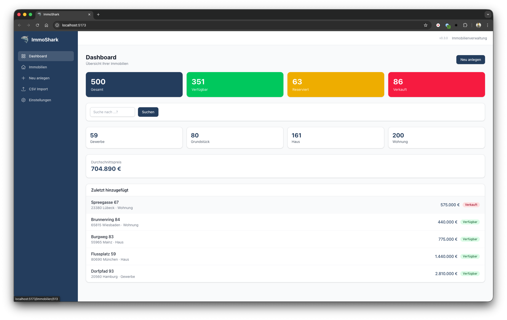
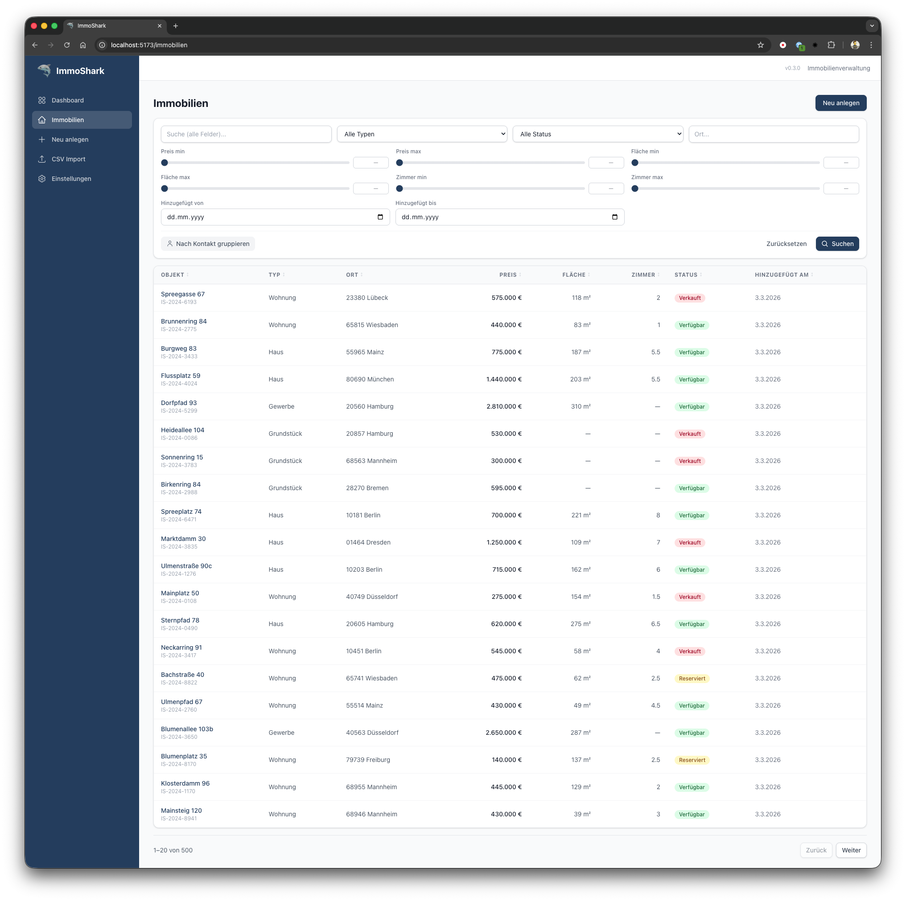
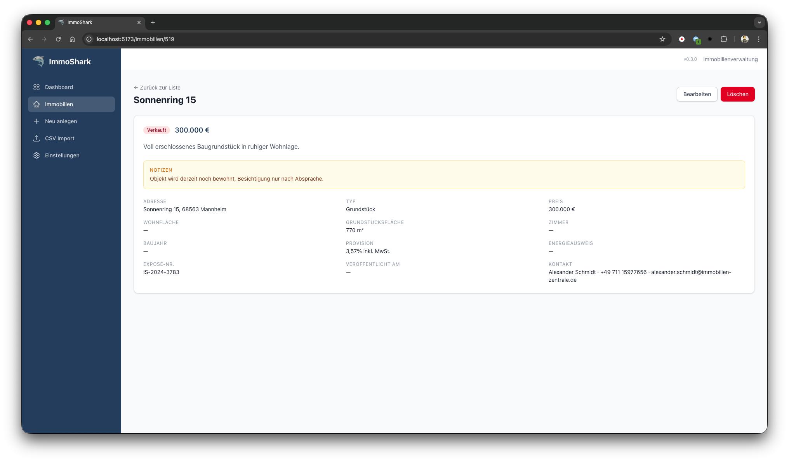
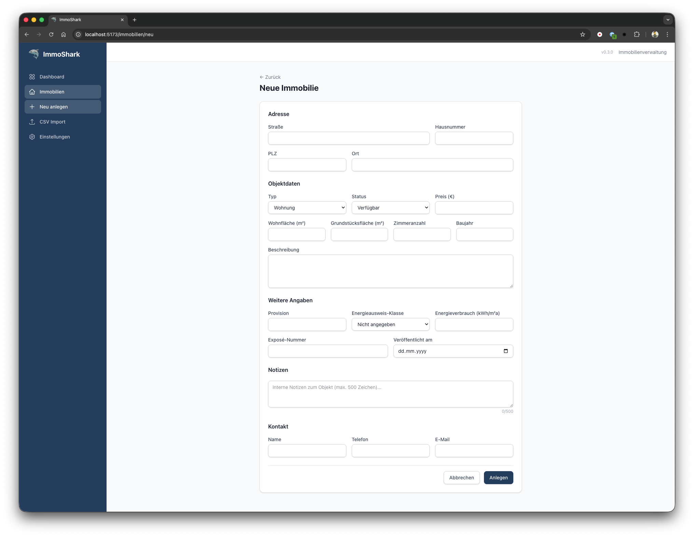
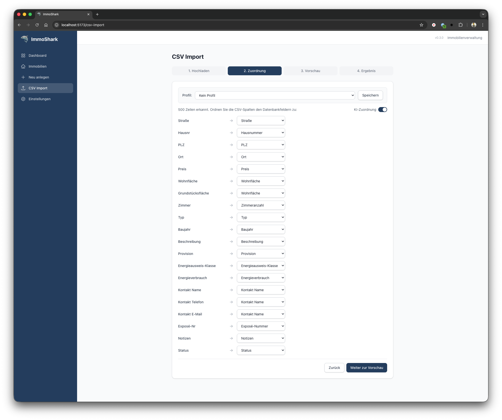
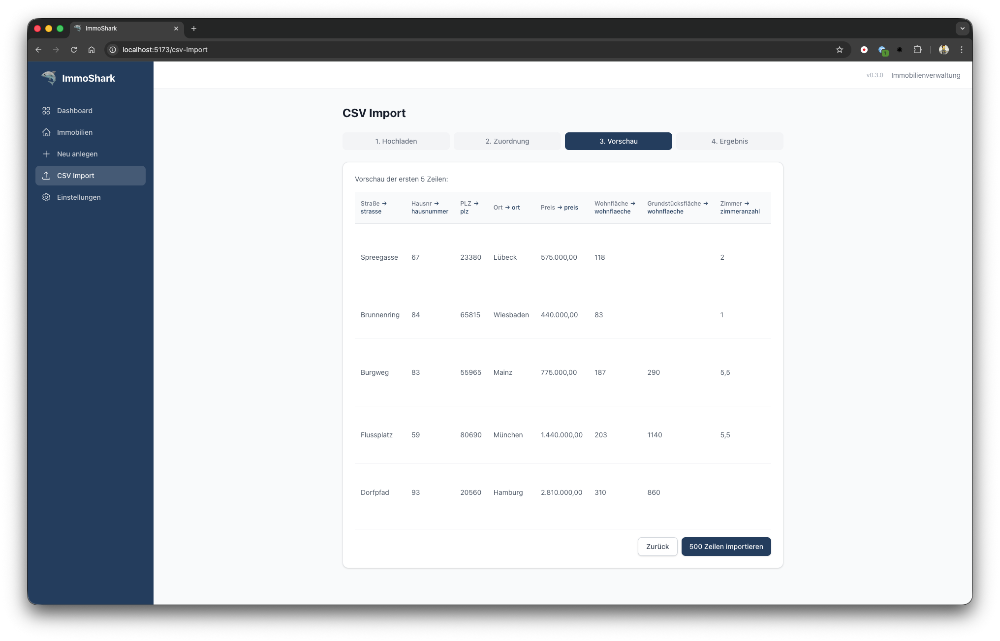
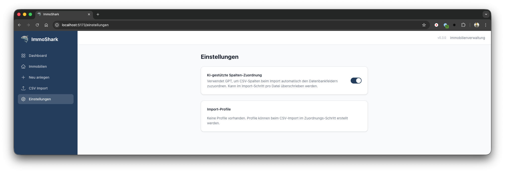

# ImmoShark — Benutzeranleitung

ImmoShark ist eine lokale Webanwendung zur Verwaltung von Immobiliendaten. Sie läuft vollständig auf Ihrem Rechner und wird im Browser unter `http://localhost:5173` aufgerufen.

---

## Inhaltsverzeichnis

1. [Aufbau der Anwendung](#1-aufbau-der-anwendung)
2. [Dashboard](#2-dashboard)
3. [Immobilien-Liste](#3-immobilien-liste)
4. [Detailansicht](#4-detailansicht)
5. [Immobilie anlegen / bearbeiten](#5-immobilie-anlegen--bearbeiten)
6. [CSV-Import](#6-csv-import)
7. [Einstellungen](#7-einstellungen)
8. [Tipps und Hinweise](#8-tipps-und-hinweise)

---

## 1. Aufbau der Anwendung

Alle Bereiche von ImmoShark erreichen Sie über die **Sidebar** (dunkle Seitenleiste links):

| Bereich | Beschreibung |
|---------|-------------|
| **Dashboard** | Statistiken, Schnellsuche und die zuletzt hinzugefügten Objekte |
| **Immobilien** | Liste aller Objekte mit Filtern, Sortierung und Volltextsuche |
| **Neu anlegen** | Formular zum Erfassen einer neuen Immobilie |
| **CSV Import** | Daten aus CSV-Dateien importieren (z. B. aus Excel) |
| **Einstellungen** | KI-Zuordnung konfigurieren und Import-Profile verwalten |

Oben rechts im Header sehen Sie die aktuelle Versionsnummer der Anwendung.

---

## 2. Dashboard

Das Dashboard verschafft Ihnen einen schnellen Überblick über den gesamten Immobilienbestand.

### Statistik-Karten

Die vier farbigen Karten am oberen Rand zeigen:

- **Gesamt** (blau) — Gesamtanzahl aller erfassten Immobilien
- **Verfügbar** (grün) — Objekte, die aktuell am Markt sind
- **Reserviert** (gelb) — Objekte mit laufender Reservierung
- **Verkauft** (rot) — Bereits verkaufte Objekte

### Schnellsuche

Unterhalb der Statistiken befindet sich ein Suchfeld. Geben Sie einen Begriff ein — z. B. einen Ort, eine Straße oder einen Kontaktnamen — und klicken Sie auf **Suchen**. Sie gelangen direkt zur gefilterten Immobilien-Liste.

### Aufschlüsselung nach Typ

Vier weitere Karten zeigen, wie sich der Bestand auf die Objekttypen verteilt: **Gewerbe**, **Grundstück**, **Haus** und **Wohnung**.

### Durchschnittspreis

Der berechnete Durchschnittspreis über alle Immobilien im Bestand.

### Zuletzt hinzugefügt

Die fünf zuletzt erfassten Objekte mit Adresse, Typ, Preis und Status. Ein Klick auf einen Eintrag öffnet die Detailansicht. Über den Button **Neu anlegen** (oben rechts) können Sie direkt eine neue Immobilie erfassen.

---

## 3. Immobilien-Liste

Die Immobilien-Liste ist das Herzstück der Anwendung. Hier finden, filtern und sortieren Sie Ihren gesamten Bestand.

### Filter verwenden

Im oberen Bereich der Seite stehen umfangreiche Filtermöglichkeiten zur Verfügung:

| Filter | Beschreibung |
|--------|-------------|
| **Suche (alle Felder)** | Volltextsuche über Adresse, Beschreibung, Kontakt, Notizen und weitere Textfelder |
| **Typ** | Wohnung, Haus, Grundstück oder Gewerbe |
| **Status** | Verfügbar, Reserviert oder Verkauft |
| **Ort** | Freitextsuche nach Ortsnamen |
| **Preis min/max** | Schieberegler mit Direkteingabe (0 bis 5 Mio.) |
| **Fläche min/max** | Schieberegler mit Direkteingabe (0 bis 2.000 m²) |
| **Zimmer min/max** | Schieberegler mit Direkteingabe (1 bis 15, in 0,5er-Schritten) |
| **Hinzugefügt von/bis** | Datumsbereich, wann das Objekt im System erfasst wurde |

Filter werden erst angewendet, wenn Sie auf **Suchen** klicken oder die Eingabetaste drücken. Mit **Zurücksetzen** setzen Sie alle Filter auf die Standardwerte zurück.

### Schieberegler bedienen

Die Regler für Preis, Fläche und Zimmer lassen sich auf zwei Arten nutzen:

1. **Schieben** — Ziehen Sie den Regler mit der Maus auf den gewünschten Wert
2. **Direkte Eingabe** — Klicken Sie auf das Zahlenfeld neben dem Regler und tippen Sie den Wert ein

### Sortieren

Klicken Sie auf eine **Spaltenüberschrift**, um die Tabelle zu sortieren:

- 1. Klick: aufsteigend
- 2. Klick: absteigend
- 3. Klick: Sortierung aufheben

Sortierbare Spalten: Objekt, Typ, Ort, Preis, Fläche, Zimmer, Status, Hinzugefügt am.

### Nach Kontakt gruppieren

Der Button **Nach Kontakt gruppieren** ordnet die Immobilien nach dem zugeordneten Ansprechpartner. So erkennen Sie auf einen Blick, welche Objekte zu welchem Kontakt gehören.

### Seitennavigation

Am unteren Rand der Tabelle blättern Sie zwischen den Seiten. Pro Seite werden 20 Objekte angezeigt. Über den Button **Neu anlegen** (oben rechts) legen Sie direkt ein neues Objekt an.

### Objekt öffnen

Ein Klick auf den **Objektnamen** (Straße + Hausnummer) in der Tabelle öffnet die Detailansicht.

---

## 4. Detailansicht

Die Detailansicht zeigt alle gespeicherten Informationen zu einer Immobilie auf einen Blick.

### Aufbau

- **Status und Preis** — Der farbige Status-Badge (z. B. „Verkauft") und der Preis stehen prominent oben
- **Beschreibung** — Freitext-Beschreibung des Objekts
- **Notizen** — Interne Notizen (gelb hinterlegt), nur für Sie sichtbar
- **Details-Raster** — Adresse, Typ, Preis, Wohnfläche, Grundstücksfläche, Zimmer, Baujahr, Provision, Energieausweis, Exposé-Nummer, Veröffentlichungsdatum und Kontaktdaten

Über den Link **Zurück zur Liste** oben links kehren Sie zur Immobilien-Liste zurück.

### Aktionen

Oben rechts stehen zwei Buttons:

- **Bearbeiten** — Öffnet das Formular mit den vorausgefüllten Daten
- **Löschen** (rot) — Löscht die Immobilie unwiderruflich (nach Sicherheitsabfrage)

---

## 5. Immobilie anlegen / bearbeiten

Über **Neu anlegen** in der Sidebar, den Button **Neu anlegen** auf dem Dashboard oder in der Immobilien-Liste gelangen Sie zum Erfassungsformular. Beim Bearbeiten eines bestehenden Objekts wird dasselbe Formular mit vorausgefüllten Daten angezeigt.

### Pflichtfelder

Folgende Felder müssen ausgefüllt werden:

- **Straße** und **Hausnummer**
- **PLZ** (genau 5 Ziffern)
- **Ort**
- **Typ** (Wohnung, Haus, Grundstück oder Gewerbe)

### Optionale Felder

Das Formular ist in vier Abschnitte gegliedert:

| Abschnitt | Felder |
|-----------|--------|
| **Objektdaten** | Status, Preis, Wohnfläche (m²), Grundstücksfläche (m²), Zimmeranzahl, Baujahr, Beschreibung |
| **Weitere Angaben** | Provision, Energieausweis-Klasse (A+ bis H), Energieverbrauch (kWh/m²a), Exposé-Nummer, Veröffentlicht am |
| **Notizen** | Internes Freitextfeld (max. 500 Zeichen) mit Zeichenzähler |
| **Kontakt** | Name, Telefon, E-Mail des Ansprechpartners |

### Speichern

Klicken Sie auf **Anlegen** (neues Objekt) bzw. **Speichern** (bestehendes Objekt). Sie werden anschließend automatisch zur Detailansicht weitergeleitet. Mit **Abbrechen** verwerfen Sie Ihre Eingaben.

---

## 6. CSV-Import

Der CSV-Import übernimmt Daten aus Tabellenkalkulationen (Excel, Google Sheets, LibreOffice Calc) in ImmoShark. Ein Assistent führt Sie in vier Schritten durch den Vorgang.

### Schritt 1: Datei hochladen

- Klicken Sie auf **CSV Import** in der Sidebar
- Wählen Sie Ihre CSV-Datei aus oder ziehen Sie sie per Drag & Drop in den Upload-Bereich
- Unterstützte Formate: `.csv` mit `;` oder `,` als Trennzeichen (wird automatisch erkannt)
- Deutsche Zahlenformate werden unterstützt (z. B. `1.234,56`)

### Schritt 2: Spalten zuordnen

Nach dem Hochladen zeigt ImmoShark alle Spalten der CSV-Datei an. Jede Spalte kann einem Datenbankfeld zugeordnet werden (z. B. „Straße" → Straße, „PLZ" → PLZ). ImmoShark versucht, passende Felder automatisch zu erkennen.

#### Import-Profile

Oben im Zuordnungs-Schritt befindet sich die **Profil-Leiste**. Wenn Sie ein bestimmtes CSV-Format regelmäßig importieren, sparen Profile erheblich Zeit:

- **Profil laden:** Wählen Sie ein gespeichertes Profil aus dem Dropdown. Die Spalten-Zuordnung und KI-Einstellung werden sofort übernommen. Spalten, die in der aktuellen CSV nicht vorkommen, werden ignoriert; neue Spalten bleiben auf „Nicht importieren".
- **Profil speichern:** Klicken Sie auf **Speichern**. Im Dialog können Sie ein neues Profil anlegen (mit Name) oder ein bestehendes überschreiben. Optional setzen Sie das Profil als **Standard** — es wird dann bei jedem zukünftigen Upload automatisch angewendet.
- **Standard-Profil:** Wenn ein Standard-Profil gesetzt ist, wird es direkt nach dem Hochladen angewendet, ohne dass Sie es manuell auswählen müssen.

#### KI-Zuordnung

Wenn die **KI-Zuordnung** aktiviert ist (Toggle rechts), analysiert GPT-5 die Spaltenüberschriften und Beispieldaten und schlägt eine intelligente Zuordnung vor. Während die KI arbeitet, erscheint der Hinweis „KI analysiert Spalten...". Sie können die KI jederzeit per Toggle deaktivieren — dann greift nur die wörterbuchbasierte Erkennung.

#### Zuordnung anpassen

- Prüfen Sie die automatische Zuordnung und passen Sie sie bei Bedarf über die Dropdown-Menüs an
- Nicht benötigte Spalten belassen Sie auf „Nicht importieren"
- **Freitext-Extraktion (KI):** Enthält eine Spalte Fließtext (z. B. eine Beschreibung mit Adresse, Preis und Kontakt in einem Feld), wählen Sie „Freitext-Extraktion (KI)". GPT-5 extrahiert dann automatisch die relevanten Daten
- Klicken Sie auf **Weiter zur Vorschau**

### Schritt 3: Vorschau prüfen

Sie sehen die ersten fünf Zeilen Ihrer CSV-Datei mit der gewählten Zuordnung. Jede Spaltenüberschrift zeigt an, welchem Datenbankfeld sie zugeordnet ist (z. B. „Straße → strasse"). Prüfen Sie, ob die Daten korrekt zugeordnet sind. Mit **Zurück** können Sie die Zuordnung noch anpassen.

Klicken Sie auf **[Anzahl] Zeilen importieren**, um den Import zu starten.

### Schritt 4: Ergebnis

Nach dem Import zeigt ImmoShark eine Zusammenfassung:

- **Importiert** — Anzahl der erfolgreich übernommenen Zeilen
- **Übersprungen** — Zeilen, die nicht importiert werden konnten (z. B. wegen fehlender Pflichtfelder)

Falls Zeilen übersprungen wurden, listet ImmoShark die jeweiligen Fehlermeldungen auf. Von hier aus können Sie eine **weitere Datei importieren** oder direkt **zur Immobilien-Übersicht** wechseln.

### Hinweise zum CSV-Import

| Thema | Details |
|-------|---------|
| **Pflichtfelder** | Jede Zeile braucht mindestens Straße, Hausnummer, PLZ, Ort und Typ |
| **Typ-Werte** | `wohnung`, `haus`, `grundstueck` oder `gewerbe` |
| **Status-Werte** | `verfuegbar`, `reserviert` oder `verkauft` |
| **Datumsformat** | Deutsches Format `TT.MM.JJJJ` oder ISO `JJJJ-MM-TT` |
| **Leere Felder** | Optionale Felder dürfen leer bleiben |
| **Telefonnummern** | Werden automatisch normalisiert (z. B. `0681/12345` → `+49 681 12345`) |
| **Ortskürzel** | Kfz-Kürzel wie SB, SLS, HOM werden zu vollen Stadtnamen aufgelöst |
| **Freitext** | „Freitext-Extraktion (KI)" extrahiert strukturierte Daten aus Fließtext-Spalten |

---

## 7. Einstellungen

Unter **Einstellungen** in der Sidebar konfigurieren Sie globale Optionen.

### KI-gestützte Spalten-Zuordnung

Der Toggle steuert, ob die KI-basierte Spalten-Zuordnung beim CSV-Import standardmäßig aktiviert ist. Diese Einstellung wird lokal gespeichert und gilt als Vorgabe für jeden neuen Import. Im Import-Schritt selbst können Sie die KI pro Datei noch ein- oder ausschalten.

### Import-Profile

Unterhalb des KI-Toggles sehen Sie alle gespeicherten Import-Profile. Jedes Profil zeigt Name, Erstelldatum, die Anzahl gespeicherter Spalten-Zuordnungen und den KI-Status (an/aus). Ein Standard-Profil ist zusätzlich mit einem Badge gekennzeichnet.

**Aktionen:**

- **Als Standard** — Setzt das Profil als Standard-Profil. Es wird beim nächsten CSV-Upload automatisch angewendet. Ein erneuter Klick entfernt den Standard-Status.
- **Löschen** — Entfernt das Profil (nach Bestätigung).

Wenn noch keine Profile angelegt wurden, erscheint der Hinweis „Keine Profile vorhanden". Profile erstellen Sie im Zuordnungs-Schritt des CSV-Imports (siehe [Schritt 2](#schritt-2-spalten-zuordnen)).

> Profile werden lokal im Browser gespeichert und stehen nur auf dem aktuellen Gerät zur Verfügung.

---

## 8. Tipps und Hinweise

### Tastenkürzel

- **Enter** — In der Filterleiste: Suche auslösen (statt auf „Suchen" zu klicken)

### URL-basierte Filter

Alle aktiven Filter werden in der Browser-Adressleiste gespeichert. Das bedeutet:

- Sie können eine gefilterte Ansicht als **Lesezeichen** speichern
- Sie können einen Filter-Link an Kollegen weiterleiten

### Daten sichern

ImmoShark speichert alle Daten lokal in einer SQLite-Datenbank (`data/immoshark.db`). Sichern Sie diese Datei regelmäßig, um Datenverlust zu vermeiden.
