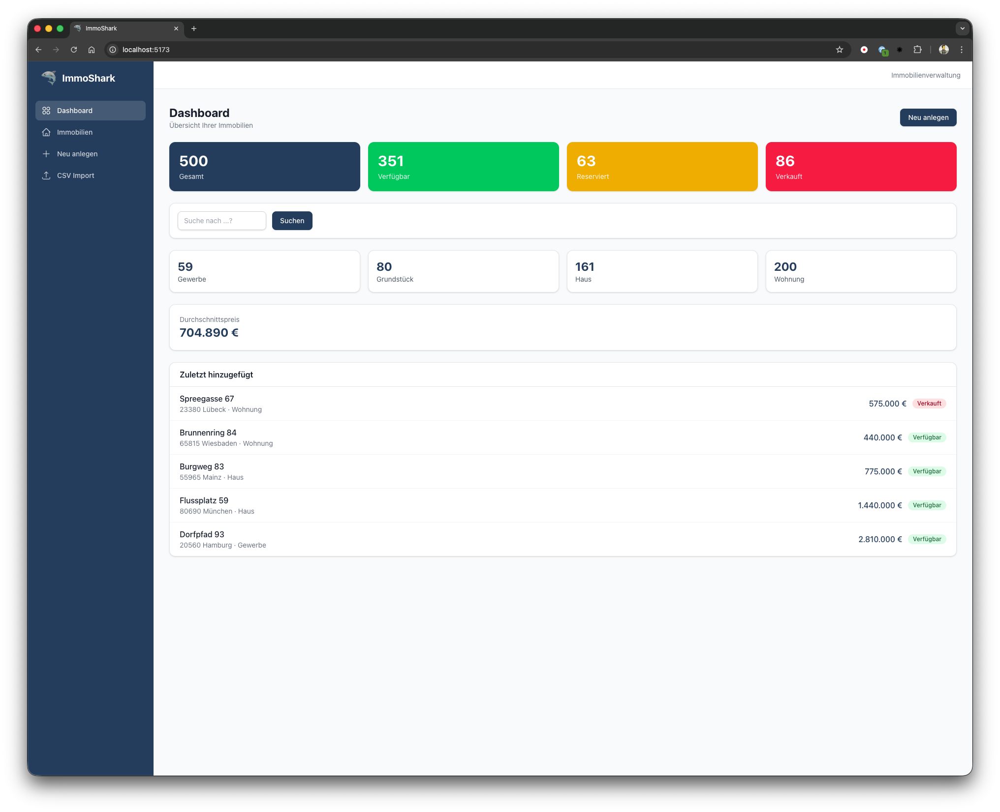
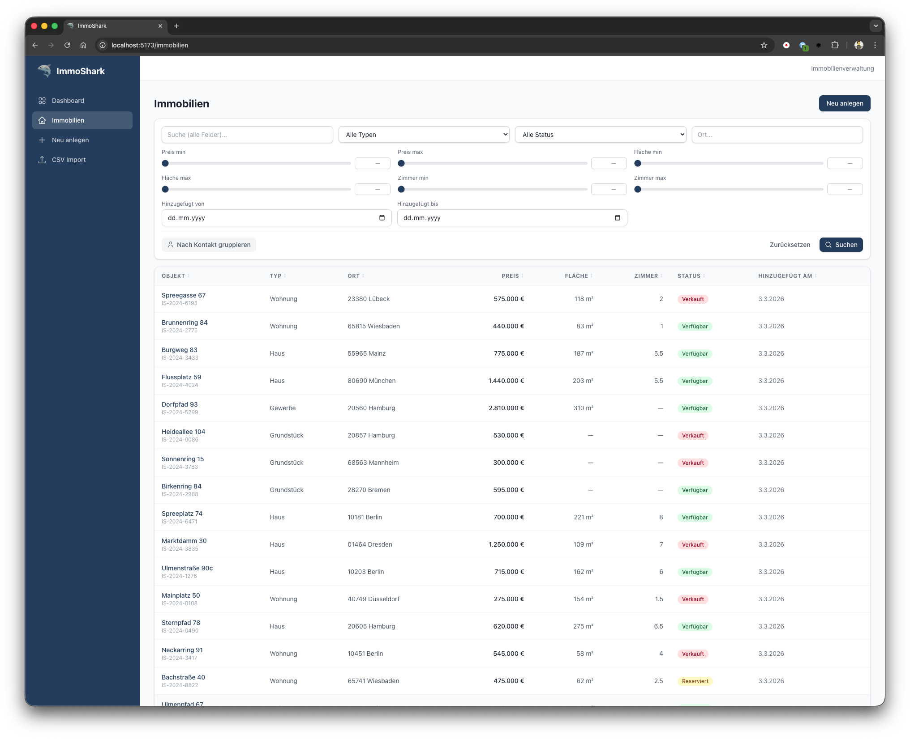
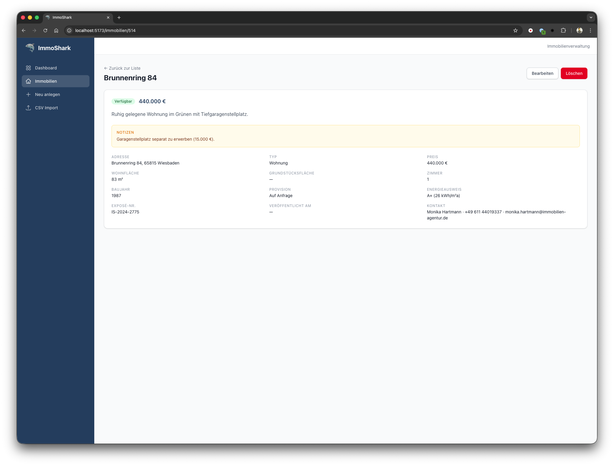
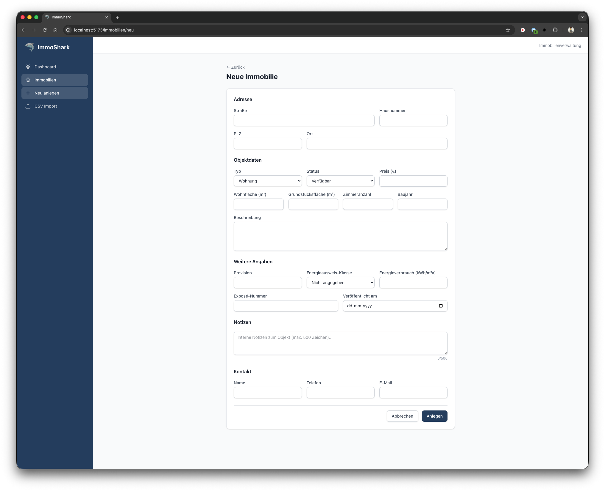

# ImmoShark — Benutzeranleitung

Diese Anleitung beschreibt die Bedienung von ImmoShark aus Anwendersicht. Die Anwendung ist eine lokale Webanwendung zur Verwaltung von Immobiliendaten und wird im Browser unter `http://localhost:5173` aufgerufen.

---

## Inhaltsverzeichnis

1. [Aufbau der Anwendung](#1-aufbau-der-anwendung)
2. [Dashboard](#2-dashboard)
3. [Immobilien-Liste](#3-immobilien-liste)
4. [Detailansicht](#4-detailansicht)
5. [Immobilie anlegen / bearbeiten](#5-immobilie-anlegen--bearbeiten)
6. [CSV-Import](#6-csv-import)
7. [Einstellungen](#7-einstellungen)
8. [Tipps und Hinweise](#8-tipps-und-hinweise)

---

## 1. Aufbau der Anwendung

ImmoShark besteht aus vier Hauptbereichen, die Sie jederzeit über die **Sidebar** (linke Seitenleiste) erreichen:

| Bereich | Beschreibung |
|---------|-------------|
| **Dashboard** | Statistiken, Schnellsuche und zuletzt hinzugefügte Objekte |
| **Immobilien** | Vollständige Liste aller Objekte mit Filtern und Sortierung |
| **Neu anlegen** | Formular zum Erfassen einer neuen Immobilie |
| **CSV Import** | Bestehende Daten aus CSV-Dateien importieren |
| **Einstellungen** | KI-Mapping und andere Einstellungen verwalten |

---

## 2. Dashboard

Das Dashboard zeigt Ihnen auf einen Blick den aktuellen Stand Ihres Immobilienbestands.

### Statistik-Karten

Ganz oben sehen Sie vier farbige Karten:

- **Gesamt** (blau) — Gesamtanzahl aller erfassten Immobilien
- **Verfügbar** (grün) — Objekte, die aktuell am Markt sind
- **Reserviert** (gelb) — Objekte mit laufender Reservierung
- **Verkauft** (rot) — Bereits verkaufte Objekte

### Schnellsuche

Unterhalb der Statistiken befindet sich ein Suchfeld. Geben Sie einen Suchbegriff ein (z. B. einen Ort, eine Straße oder einen Kontaktnamen) und klicken Sie auf **Suchen**. Sie werden direkt zur gefilterten Immobilien-Liste weitergeleitet.

### Aufschlüsselung nach Typ

Vier Karten zeigen die Anzahl der Objekte pro Typ: **Gewerbe**, **Grundstück**, **Haus** und **Wohnung**.

### Durchschnittspreis

Der berechnete Durchschnittspreis über alle Immobilien im Bestand.

### Zuletzt hinzugefügt

Eine Liste der fünf zuletzt hinzugefügten Objekte mit Adresse, Typ, Preis und Status. Ein Klick auf ein Objekt führt Sie direkt zur Detailansicht.

---

## 3. Immobilien-Liste

Die Immobilien-Liste ist das Herzstück der Anwendung. Hier finden, filtern und sortieren Sie Ihren gesamten Bestand.

### Filter verwenden

Im oberen Bereich stehen Ihnen umfangreiche Filtermöglichkeiten zur Verfügung:

| Filter | Beschreibung |
|--------|-------------|
| **Suche (alle Felder)** | Volltextsuche über Adresse, Beschreibung, Kontakt, Notizen u. v. m. |
| **Typ** | Wohnung, Haus, Grundstück oder Gewerbe |
| **Status** | Verfügbar, Reserviert oder Verkauft |
| **Ort** | Freitextsuche nach Ortsnamen |
| **Preis min/max** | Schieberegler mit Direkteingabe (0 bis 5 Mio.) |
| **Fläche min/max** | Schieberegler mit Direkteingabe (0 bis 2.000 m²) |
| **Zimmer min/max** | Schieberegler mit Direkteingabe (1 bis 15, in 0,5er-Schritten) |
| **Hinzugefügt von/bis** | Datumsbereich, wann das Objekt im System erfasst wurde |

**Wichtig:** Filter werden erst angewendet, wenn Sie auf den Button **Suchen** klicken oder die Eingabetaste drücken. Alternativ können Sie alle Filter mit **Zurücksetzen** auf die Standardwerte zurücksetzen.

### Schieberegler bedienen

Die Schieberegler für Preis, Fläche und Zimmer können Sie auf zwei Arten nutzen:

1. **Schieben** — Ziehen Sie den Regler mit der Maus auf den gewünschten Wert
2. **Direkte Eingabe** — Klicken Sie auf das Zahlenfeld rechts neben dem Regler und tippen Sie den gewünschten Wert ein

### Sortieren

Klicken Sie auf eine **Spaltenüberschrift** in der Tabelle, um nach dieser Spalte zu sortieren:

- Erster Klick: aufsteigend sortieren
- Zweiter Klick: absteigend sortieren
- Dritter Klick: Sortierung aufheben

Sortierbare Spalten: Objekt, Typ, Ort, Preis, Fläche, Zimmer, Status, Hinzugefügt am.

### Nach Kontakt gruppieren

Mit dem Button **Nach Kontakt gruppieren** werden die Immobilien nach dem zugeordneten Ansprechpartner gruppiert. So sehen Sie auf einen Blick, welche Objekte zu welchem Kontakt gehören.

### Seitennavigation

Am unteren Rand der Tabelle können Sie zwischen den Seiten blättern. Pro Seite werden 20 Objekte angezeigt.

### Objekt öffnen

Klicken Sie auf den **Objektnamen** (Straße + Hausnummer) in der Tabelle, um zur Detailansicht zu gelangen.

---

## 4. Detailansicht

Die Detailansicht zeigt alle Informationen zu einer einzelnen Immobilie.

### Angezeigte Informationen

- **Status und Preis** — Farbiger Status-Badge und Preis prominent oben
- **Beschreibung** — Freitext-Beschreibung des Objekts
- **Notizen** — Interne Notizen (gelb hinterlegt), nur für Sie sichtbar
- **Details** — Adresse, Typ, Wohnfläche, Grundstücksfläche, Zimmer, Baujahr, Provision, Energieausweis, Exposé-Nummer, Veröffentlichungsdatum und Kontaktdaten

### Aktionen

Oben rechts stehen zwei Buttons:

- **Bearbeiten** — Öffnet das Formular zum Bearbeiten der Immobilie
- **Löschen** — Löscht die Immobilie (nach Sicherheitsabfrage)

---

## 5. Immobilie anlegen / bearbeiten

Über **Neu anlegen** in der Sidebar oder den Button **Neu anlegen** auf dem Dashboard erreichen Sie das Formular zur Erfassung einer neuen Immobilie. Das gleiche Formular wird auch beim Bearbeiten verwendet.

### Pflichtfelder

Folgende Felder müssen ausgefüllt werden:

- **Straße** und **Hausnummer**
- **PLZ** (5 Ziffern)
- **Ort**
- **Typ** (Wohnung, Haus, Grundstück oder Gewerbe)

### Optionale Felder

| Abschnitt | Felder |
|-----------|--------|
| **Objektdaten** | Status, Preis, Wohnfläche, Grundstücksfläche, Zimmeranzahl, Baujahr, Beschreibung |
| **Weitere Angaben** | Provision, Energieausweis-Klasse (A+ bis H), Energieverbrauch, Exposé-Nummer, Veröffentlicht am |
| **Notizen** | Internes Freitextfeld (max. 500 Zeichen) mit Zeichenzähler |
| **Kontakt** | Name, Telefon, E-Mail des Ansprechpartners |

### Speichern

Klicken Sie auf **Anlegen** (neues Objekt) bzw. **Speichern** (bestehendes Objekt), um die Daten zu sichern. Sie werden anschließend automatisch zur Detailansicht weitergeleitet.

---

## 6. CSV-Import

Der CSV-Import ermöglicht Ihnen, große Datenmengen aus Tabellenkalkulationen (Excel, Google Sheets, etc.) in ImmoShark zu übernehmen.

### Schritt 1: Datei hochladen

- Klicken Sie auf **CSV Import** in der Sidebar
- Wählen Sie Ihre CSV-Datei aus oder ziehen Sie sie per Drag & Drop in den Upload-Bereich
- Unterstützte Formate: `.csv` mit `;` oder `,` als Trennzeichen (wird automatisch erkannt)
- Deutsche Zahlenformate werden unterstützt (z. B. `1.234,56`)

### Schritt 2: Spalten zuordnen

Nach dem Hochladen werden die Spalten Ihrer CSV-Datei angezeigt. ImmoShark versucht automatisch, die Spalten den passenden Feldern zuzuordnen (z. B. "Straße" wird "Straße" zugeordnet).

**KI-Zuordnung:** Wenn die KI-Zuordnung aktiviert ist (Toggle oben rechts), analysiert eine KI (GPT-5) die Spaltenüberschriften und Beispieldaten und schlägt ein intelligenteres Mapping vor. Während die KI arbeitet, erscheint der Hinweis "KI analysiert Spalten...". Sie können die KI-Zuordnung jederzeit per Toggle deaktivieren — dann wird nur die wörterbuchbasierte Erkennung verwendet.

- Prüfen Sie die automatische Zuordnung (mit oder ohne KI)
- Passen Sie die Zuordnung bei Bedarf über die Dropdown-Menüs an
- Nicht benötigte Spalten können Sie auf "Nicht zuordnen" belassen
- Klicken Sie auf **Weiter zur Vorschau**

### Schritt 3: Vorschau prüfen

Sie sehen eine Vorschau der ersten Zeilen mit der gewählten Zuordnung. Prüfen Sie, ob die Daten korrekt zugeordnet sind.

### Schritt 4: Import starten

- Klicken Sie auf **Import starten**
- Nach dem Import sehen Sie eine Zusammenfassung: wie viele Zeilen importiert und wie viele übersprungen wurden
- Übersprungene Zeilen werden mit einer Fehlermeldung aufgelistet (z. B. fehlende Pflichtfelder)

### Tipps zum CSV-Import

- **Pflichtfelder beachten:** Jede Zeile braucht mindestens Straße, Hausnummer, PLZ, Ort und Typ
- **Typ-Werte:** Verwenden Sie `wohnung`, `haus`, `grundstueck` oder `gewerbe`
- **Status-Werte:** Verwenden Sie `verfuegbar`, `reserviert` oder `verkauft`
- **Datumswerte:** Datumsangaben (z. B. "Veröffentlicht am") können im deutschen Format `TT.MM.JJJJ` oder ISO-Format `JJJJ-MM-TT` eingegeben werden
- **Leere Felder:** Optionale Felder dürfen leer gelassen werden

---

## 7. Einstellungen

Über **Einstellungen** in der Sidebar können Sie globale Optionen für ImmoShark konfigurieren.

### KI-gestützte Spalten-Zuordnung

Ein Toggle, mit dem Sie die KI-basierte Spalten-Zuordnung beim CSV-Import standardmäßig aktivieren oder deaktivieren können. Diese Einstellung wird lokal gespeichert und gilt als Default für jeden neuen Import. Im Import-Schritt selbst können Sie die KI-Zuordnung pro Datei noch überschreiben.

### Versionsanzeige

Im Header der Anwendung (oben rechts) wird die aktuelle Version von ImmoShark angezeigt.

---

## 8. Tipps und Hinweise

### Tastenkürzel

- **Enter** — In der Filterleiste: Suche auslösen (statt auf "Suchen" zu klicken)

### URL-basierte Filter

Alle aktiven Filter werden in der Browser-Adressleiste gespeichert. Das bedeutet:

- Sie können eine gefilterte Ansicht als **Lesezeichen** speichern
- Sie können einen Filter-Link an Kollegen weiterleiten

### Daten sichern

ImmoShark speichert alle Daten lokal in einer SQLite-Datenbank (`server/immoshark.db`). Sichern Sie diese Datei regelmäßig, um Datenverlust zu vermeiden.
